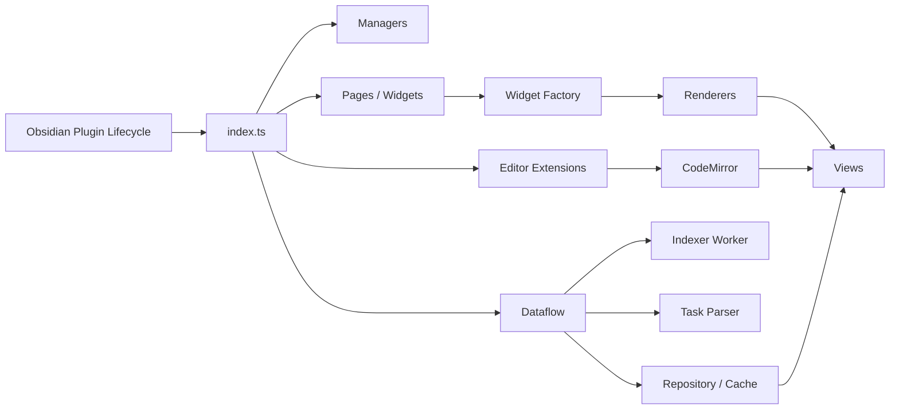
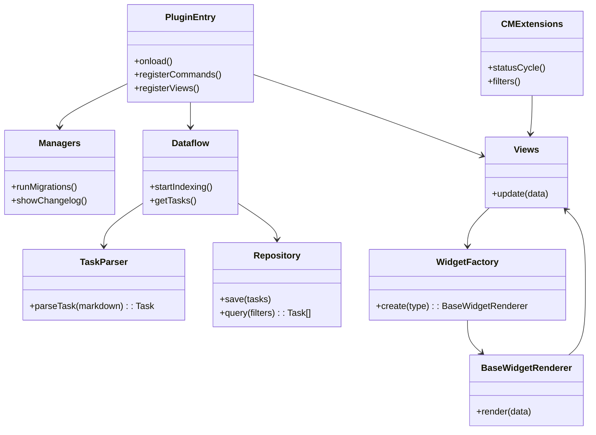
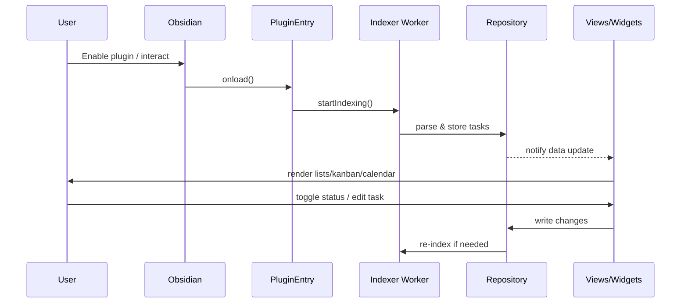
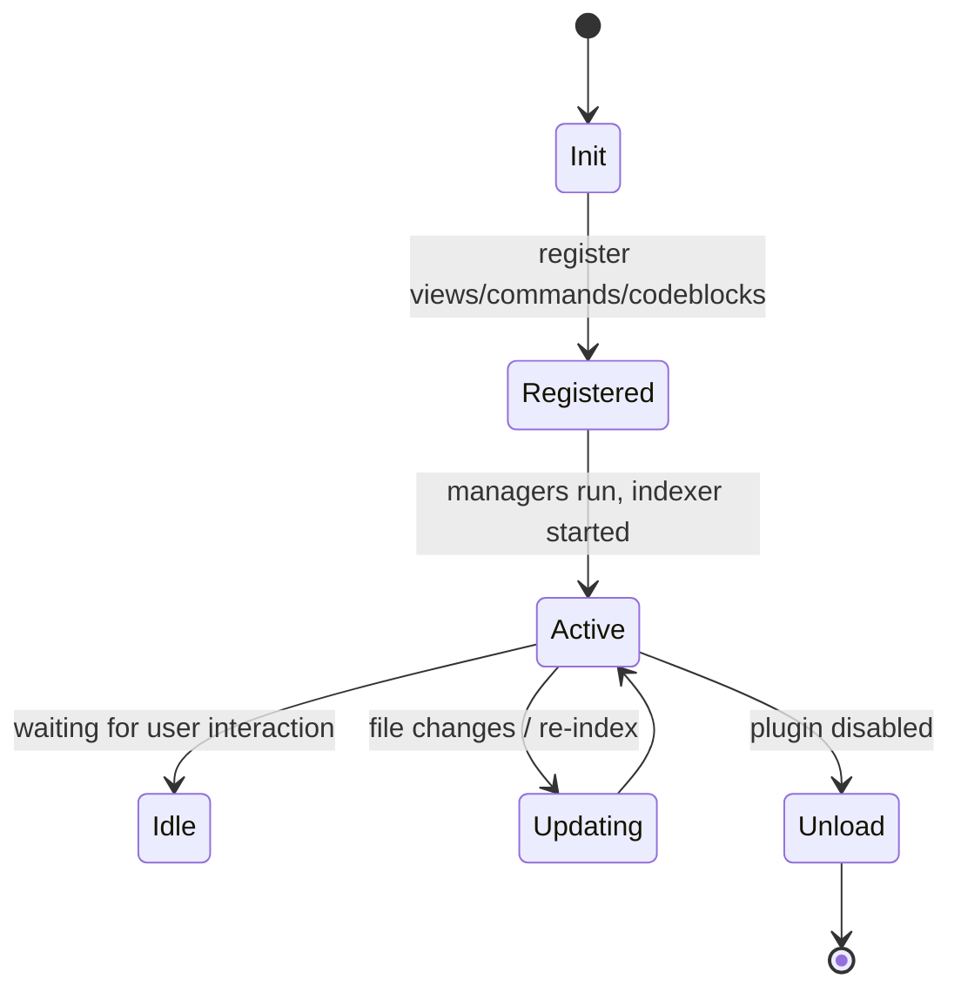

# Task Genius 架构概览与核心设计

日期：2026-01-22

## 技术栈与架构概览

- 平台/宿主：Obsidian（桌面与移动，minAppVersion ≥ 0.15.2）
- 语言与编译：TypeScript 4.7.x，esbuild（bundling + sass），Jest/ts-jest（测试）
- UI/编辑器：CodeMirror 6（状态、视图、语言、搜索等扩展）
- 数据/算法：date-fns、rrule（重复规则）、chrono-node（自然语言时间解析）、localforage（持久化/缓存）
- 生态/工具：pnpm workspace、release-it、husky、dotenv、Sass
- 插件结构：单体插件架构（monolith），内部模块化拆分（components、pages、widgets、dataflow、editor-extensions、managers、utils 等），并通过 Web Worker（esbuild-plugin-inline-worker）承载索引与重任务逻辑

总体架构形态：
- 单体应用 + 事件驱动（Obsidian 插件生命周期）
- 前端内核（Obsidian API）驱动 UI 视图与编辑器扩展
- 后台索引 Worker 负责扫描、解析与数据仓库更新
- 以模块化方式组织视图（Pages/Widgets）、管理器（Managers）、数据流（Dataflow）、工具库（Utils）、国际化（translations）等

## 核心架构设计原则与设计模式

- 高内聚、低耦合：按功能域划分目录；视图、渲染器、数据处理分离
- SOLID 原则：
  - 单一职责：TaskParser、索引器、渲染器、视图独立
  - 开闭原则：WidgetFactory 可扩展新组件；filters/grouping 可扩展
  - 依赖倒置：视图依赖抽象（接口/类型）而非具体实现
- 设计模式：
  - 工厂模式：WidgetFactory、BaseWidgetRenderer 用于实例化不同 Widget
  - 策略模式：任务过滤、分组、排序（filter-compatibility、grouping、priority-utils）
  - 观察者/发布订阅：编辑器事件、视图刷新、Worker 消息
  - 适配器模式：TaskCalendarAdapter 统一外部日历接口
  - 外观模式：Managers 汇聚复杂启动/迁移/更改日志等流程

## 模块划分与主要组件交互

目录概要（根据 DEVELOPMENT.md 与 src/ 结构）：
- src/index.ts：插件入口，注册视图、命令、CodeBlock、设置等
- components/：纯 UI 组件与设置面板
- pages/：视图容器（TaskView、Bases、Widgets 等）
- widgets/：
  - views/：Kanban/Tasks/Projects/Calendar/Forecast 等 WidgetView
  - renderers/：对应渲染器（BaseWidgetRenderer、TasksWidgetRenderer 等）
  - core/：WidgetShell、WidgetFactory、状态管理（useWidgetState）、过滤上下文（GlobalFilterContext）
  - codeblock/：WidgetCodeBlockProcessor，将 Markdown 代码块转为 Widget 渲染
- editor-extensions/：CodeMirror 扩展（状态栏、过滤、选择器、计时器等）
- dataflow/：任务索引与仓库（解析、缓存、数据源聚合）
- managers/：入门引导、迁移、变更日志、Obsidian URI 等较高层管理
- utils/：通用工具（日期、文件、ID、设置迁移、优先级、过滤等）
- translations/：多语言支持（en、zh-cn、ja 等）
- types/：领域类型（Task、FileTask、CalendarProvider、Bases 等）

主要交互流程：
1. 插件启动（index.ts）注册命令/视图/代码块处理器
2. Managers 执行迁移与初始化，Dataflow 启动索引（可能在 Worker 中）
3. 索引器扫描 Vault 文件，TaskParser 解析 Markdown 任务 -> 存入 Repository（localforage/内存）
4. Widgets 与 Pages 订阅数据变化，通过渲染器与 Shell 组合渲染
5. Editor-extensions 与 Obsidian 编辑器交互，提供状态循环、过滤、选择、计时等
6. 用户交互（状态切换、编辑）触发任务写回与索引刷新

输入/输出与核心 API（概念层）：
- 输入：Obsidian 文件系统、Markdown 任务语法、用户交互（命令/快捷键/代码块）
- 输出：视图与组件渲染、任务状态更新、日历/看板/列表/统计等
- API/功能点：任务解析（TaskParser）、索引/缓存（Dataflow/Repository）、过滤与分组（utils/grouping、task-filter-utils）、渲染器与视图（widgets/renderers、views）、设置迁移（SettingsMigrationManager）

## 架构图示（Mermaid）

### 框架图（整体模块）

### 类/关系图（核心对象）

### 数据流图（索引与渲染）

### 生命周期图（Obsidian 插件）

---

附注：
- esbuild.config.mjs 在生产模式下复制 manifest.json 并处理 styles.css（Sass 输出与设置注释拼接），并以 inline-worker 启动索引器（workerName: "Task Genius Indexer"）。
- jest.config.js 使用 jsdom 环境，映射 obsidian/codemirror 等到 mocks，测试匹配 __tests__/**/*.test.ts。